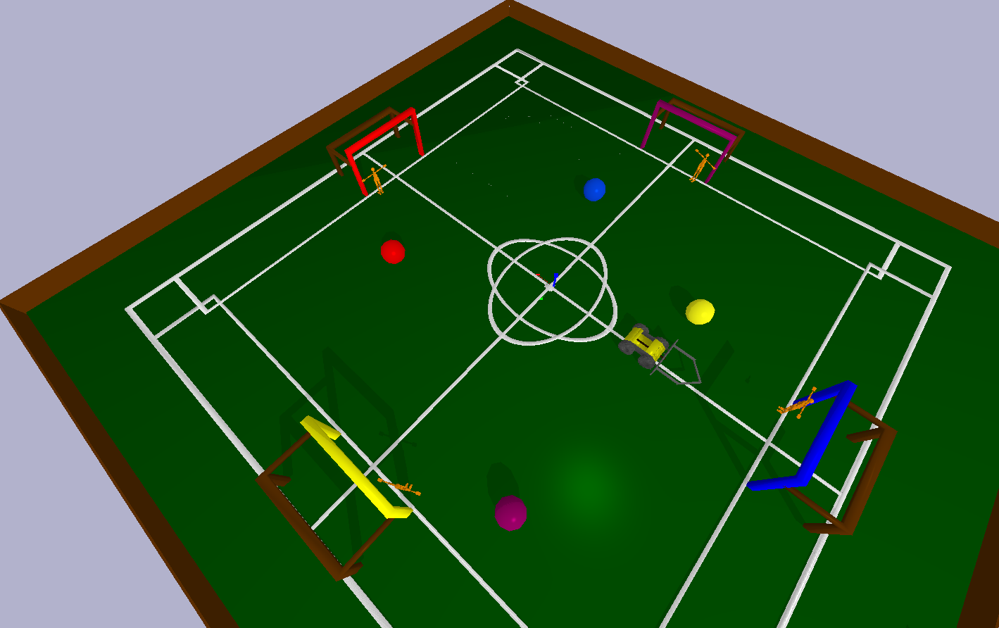
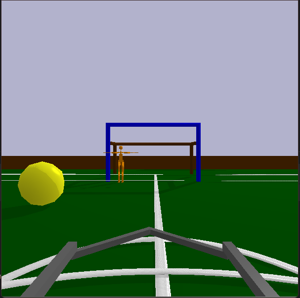

  
  <i>presents:</i>  

# La-RoboLiga

### Welcome to the problem statement of La-Robo-Liga 2024.    
This repository holds the **official arena for the event** which will be used for evaluation of the submissions by the participants.

## Installation Guidelines  
1. We recommend creating a virtual environment specific to this project. This will help in package management and for decluttering your workspace. An easy way to do so is by entering command:

   ~~~bash
   python3 -m venv <Env_Name>
   ~~~

   Activation and deactivation of your virtual environment, will be done as specified [here](https://docs.python.org/3/library/venv.html). Scroll down to the table where the activation method for various operating systems is provided. Deactivation, in most cases, can be done by simply typing deactivate while being in in the virtual environment.

2. Once you activate your virtual environment, you will have to install the various dependencies of this project. We have simplified this process for you. Just follow the following steps:
   * Download/Clone this repository on to your local machine.
   * Navigate to the root folder of this repository through your terminal.
   * Execute the following command in your terminal.

      ~~~bash
      pip install LaRoboLiga24
      ~~~

In case there are problems with the PyBullet installation, you can refer to this [guide](https://github.com/Robotics-Club-IIT-BHU/Robo-Summer-Camp-20/blob/master/Part1/Subpart%201/README.md).

Refer to the [Winter Camp](https://github.com/Robotics-Club-IIT-BHU/Robotics-Winter-Camp-2023)

## Getting started
first of all , you'll have to import the package LRL-main-arena, this can only be done if you have performed the step 1 in Installation guidelines properly. 

[//]: # (~~~python)

[//]: # (env = gym.make&#40;'LaRoboLiga24',)

[//]: # (    arena = "arena2")

[//]: # (    car_location=CAR_LOCATION,)

[//]: # (    visual_cam_settings=VISUAL_CAM_SETTINGS)

[//]: # (&#41;)

[//]: # (~~~)
* see the example scripts. You'll need to make the working loop, for continuous simulation in pybullet.
For the probem statement navigate to PS1 and PS2 folder and there are python scripts that will launch the arenas and you have to code in them 
### Moment of Truth
If you have done everything right, you should be able to see something like this after launching any of the provided scripts.

  
 <i>Ladies and gentlemen, I present to you... La Robo Liga!</i>

## The Problem Statement  
There are Two PS, the first one is about Autonomus navigation and The second is RoboLeague where you will have to score Goals  
For the problem statement click [here](LA-ROBOLIGA.pdf) 
## A Sample Camera Image

  
 <i>Husky's Eye</i>

  
